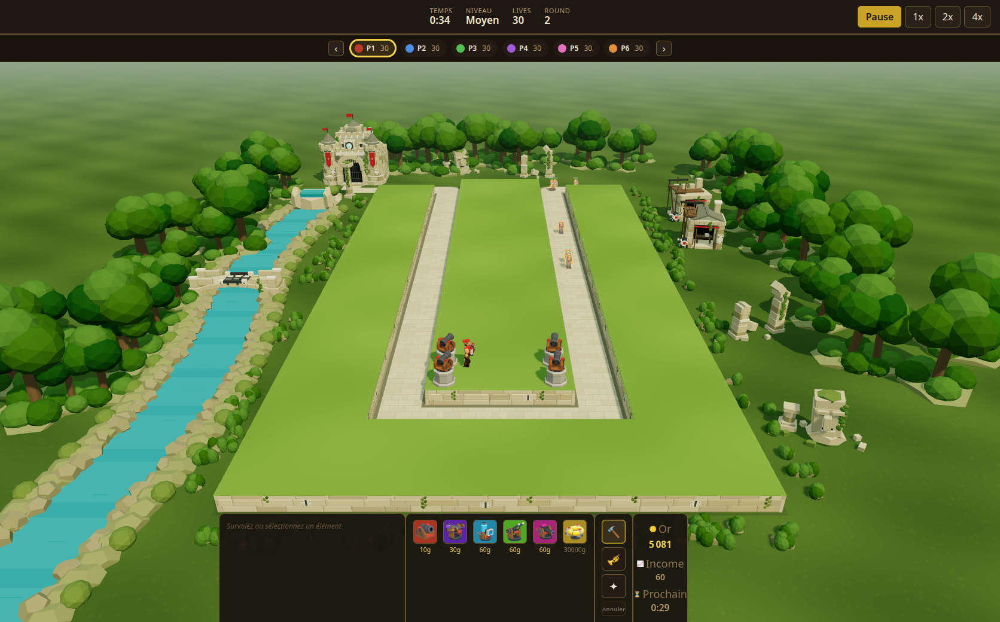

# Intégration : Ruines antiques / Sanctuaire des machines



## Résultat

Le plateau conserve ses contours et ses hauteurs : herbe verte à variations douces, soutènements en blocs de pierre biseautés avec joints, fissures, lierre et réparations ivoire. Le chemin existant reçoit une texture de dallage clair, sans changement de largeur, de parcours ou de niveau.

Un château à deux tours et donjon, équipé de bannières d'équipe, de renforts mécaniques et d'un petit cœur turquoise, est raccordé à la **véritable sortie** par un parvis extérieur en L. Ce raccord permet de voir la façade depuis la caméra initiale sans déplacer le dernier waypoint. Deux ateliers avec échafaudages et robots, des arches brisées, colonnes, fragments de statue, bosquets et une rivière avec pont réparé composent les abords. L'eau et la petite cascade sont statiques et opaques.

Le cadrage initial montre le U entier, le château et le builder au-dessus de la barre de commandes. Les contrôles de caméra restent les mêmes. Les matériaux sont peu coûteux, les géométries sont partagées et les répétitions instanciées par secteur. Aucun asset livré, aucune donnée de gameplay et aucune dépendance n'ont été modifiés.

Le module possède ses ressources ; changer de joueur reteinte les bannières sans reconstruction. Son démontage est explicite et idempotent, distinct de celui des tours et creeps. La destruction générale de scène déduplique aussi géométries, matériaux et textures et libère les buffers d'instances.

## Vérifications

- `pnpm test` : **20 fichiers, 228 tests réussis**. Les 18 nouveaux tests contrôlent l'emprise sur les huit lanes de données à deux densités, les six couleurs de joueur, l'activation et le cycle de vie des ressources.
- `pnpm typecheck` : réussi.
- `pnpm --filter @tower-defense/web build` : réussi. Vite signale un chunk principal supérieur à 500 kB, sans erreur de compilation.
- `git diff --check` : réussi ; aucune nouvelle ligne de code avec caractère non ASCII.
- Navigateur : construction de quatre tours par les vrais boutons et clics sur des emplacements projetés, déplacement du builder et achèvement de sa file, sélection avec panneau de statistiques, déplacement des creeps et dégâts constatés pendant une attaque.
- Les six arènes ont été visitées : bannières rouge, bleu, vert, violet, rose et orange ; observation activée pour les adversaires.
- Trois cycles complets de changement d'arène après chargement : mêmes objets et ressources de décor, compteurs globaux stables à **187 géométries / 38 textures**.
- Trois redémarrages depuis une arène adverse : un seul groupe de décor, mêmes identifiants de ressources, retour à la bannière rouge ; compteurs stables à **153 géométries / 4 textures** après suppression des unités de la partie précédente.
- Translation, zoom et rotation de caméra exercés avec des événements de souris natifs.
- Aucune erreur JavaScript relevée pendant ces essais.

Les avertissements de chargement GLB sous Vitest étaient présents avant l'intégration ; les tests utilisent le repli procédural. Le navigateur charge les modèles livrés normalement.

## Coût mesuré du décor

Mesure du 15 septembre 2026 dans Chrome headless, **rendu logiciel SwiftShader**, canvas **1672 × 936**, DPR 1. Partie locale Moyen, seed 42, arrêtée au tick 675 : **4 tours et 9 creeps visibles**, 28 tours et 34 creeps dans l'ensemble des arènes. Caméra, cible, tick, positions, unités et état des builders vérifiés identiques par signature avant chaque mesure.

Chaque état a 2,5 secondes de stabilisation puis 11,5 secondes d'échantillonnage. Le second passage avec décor vérifie la reproductibilité. Les appels et triangles proviennent de `renderer.info`, **passes d'ombres comprises**.

| État de la même scène | Images mesurées | Temps moyen/image | Appels de dessin | Triangles |
| --- | ---: | ---: | ---: | ---: |
| Décor visible | 36 | 322,7 ms | 237 | 259 780 |
| Décor masqué | 76 | 152,4 ms | 170 | 104 344 |
| Décor visible, retour | 35 | 323,8 ms | 237 | 259 780 |

**Surcoût : 67 appels et 155 436 triangles.** Le temps CPU de soumission du rendu est d'environ 3,58 ms avec décor et 2,99 ms sans. Les compteurs restent à **151 géométries / 13 textures** pendant toute la comparaison : masquer le décor évite son rendu mais conserve ses ressources pour le réafficher sans reconstruction.

Ces temps élevés caractérisent le moteur logiciel de test. Ils ne permettent pas de conclure sur les performances d'un GPU matériel, qui restent à mesurer. Le commutateur masque l'environnement `sanctuary` ; le plateau, son soutènement et le dallage restent présents dans les deux cas. Ce tableau ne compare donc pas l'ancien et le nouveau terrain.

[Mesures brutes](mesures.json) · [Vérifications navigateur](verification.json)

## Paramètres et comparaison manuelle

En développement, ouvrir `/?dev=1&perf=1&seed=42`, puis utiliser la pause et :

```js
window.__dev.setSceneryEnabled(false);
window.__dev.setSceneryEnabled(true);
window.__perf.getReport();
```

`&decor=0` masque le décor dès le lancement. L'option est réservée à `?dev=1` sur le serveur de développement. Les options de création comprennent `enabled`, `density` (0 à 2) et `colors` ; voir [la documentation du module](../../apps/web/src/sanctuary/README.md).

## Fichiers modifiés ou ajoutés

- `apps/web/src/terrain3d.ts` : herbe, soutènements et détails des faces.
- `apps/web/src/scene3d.ts` : dallage, sol, éclairage, cadrage, intégration et destruction des ressources.
- `apps/web/src/main.ts` : création, couleurs d'équipe et redémarrage, option de développement.
- `apps/web/src/dev.ts` : commutateur de décor à l'exécution.
- `apps/web/src/sanctuary/types.ts` : options et contrats.
- `apps/web/src/sanctuary/batch.ts` : ressources et lots instanciés.
- `apps/web/src/sanctuary/layout.ts` : placement depuis les coordonnées réelles et exclusion des surfaces jouables.
- `apps/web/src/sanctuary/structures.ts` : modèles procéduraux.
- `apps/web/src/sanctuary/index.ts` : assemblage, végétation, rivière et cycle de vie.
- `apps/web/src/sanctuary/README.md` : configuration et conventions.
- `apps/web/test/sanctuary.test.ts` : invariants d'emprise, d'équipe et de ressources.
- `docs/sanctuary/README.md`, `resultat.png`, `mesures.json`, `verification.json` : compte rendu et preuves de vérification.

## Limites

La référence est interprétée avec des primitives low-poly, sans reproduire son niveau de détail peint. La rivière utilise un relief décoratif au-dessus du grand sol existant et sous le plateau, sans creuser la géométrie de gameplay. Aucune animation d'eau ni reflet n'est ajouté. Les proportions du plateau sont celles du jeu, différentes de celles de l'illustration.

Les essais navigateur simulent uniquement la réponse locale de `/api/auth/me` pour franchir le launcher sans serveur de comptes ; la partie, ses boutons, sa simulation et son rendu sont ceux de l'application. Le backend et le multijoueur réseau ne sont pas couverts par ces essais visuels.
